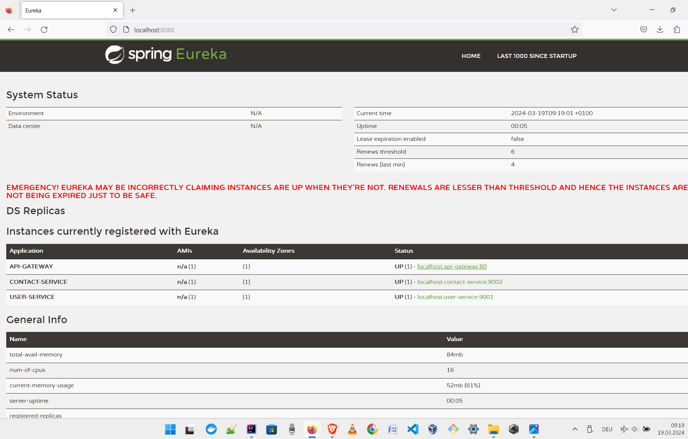
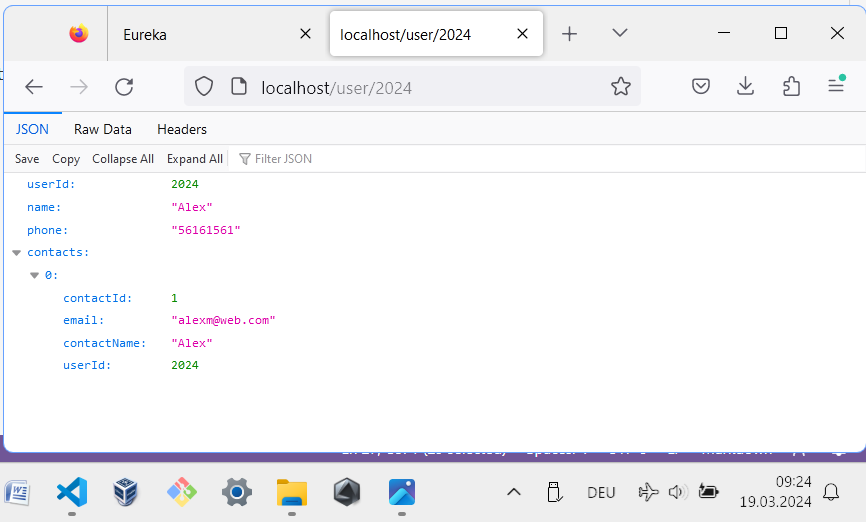
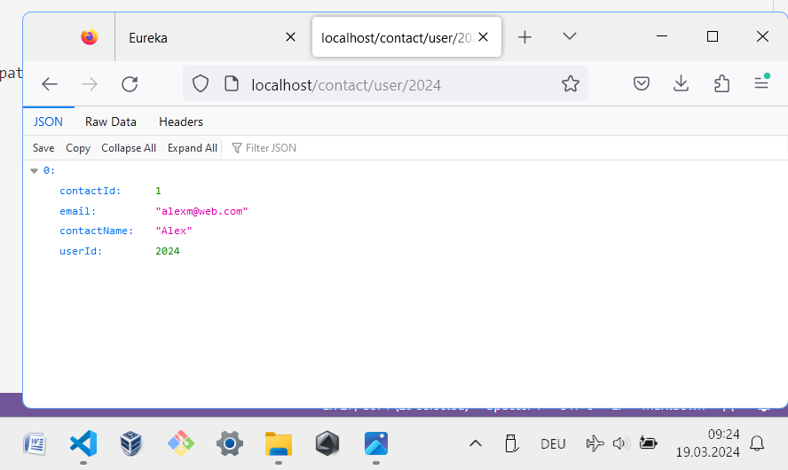
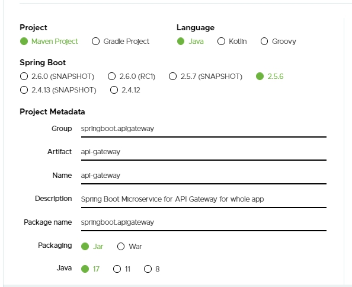
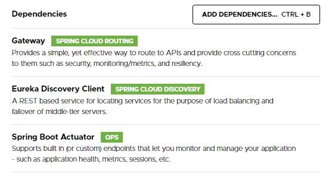
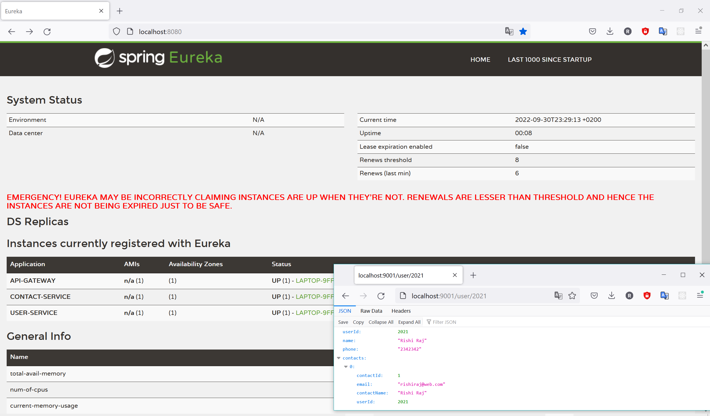
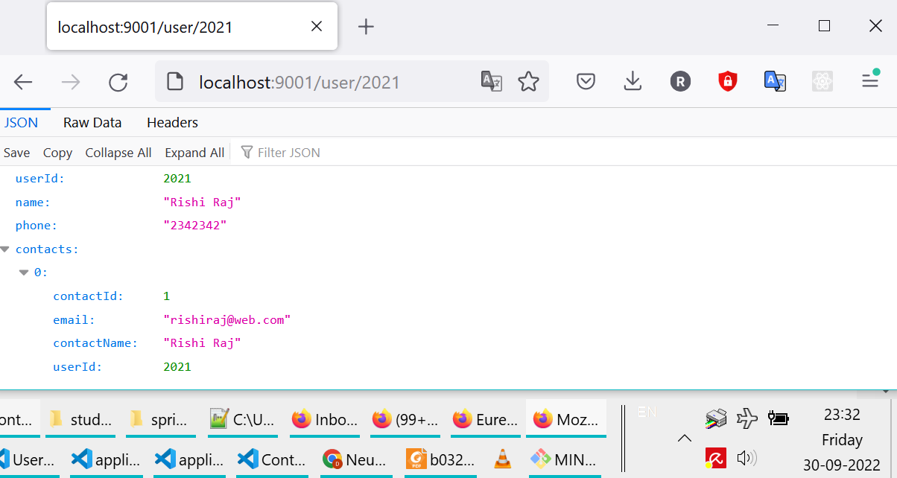
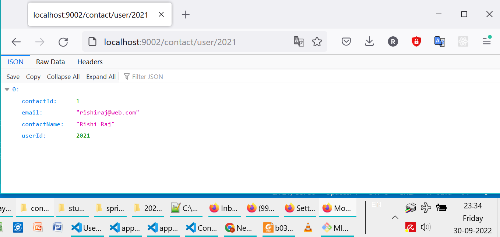
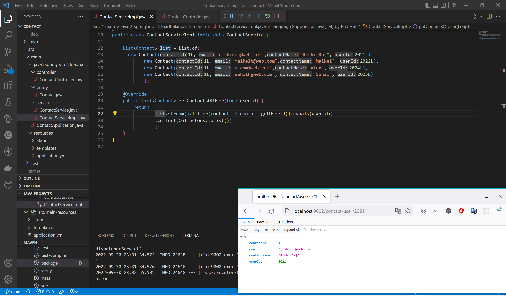

# Contacts Service App
A contact-search application, showcasing Eureka Service Discovery implemented with Spring Boot.
The following tools are used for implementation of microservices of the app:
- Spring Boot v2.5.6
- Java 17
- Various dependencies for different Microservices/modules

## Status as on 91-Mar-2024
The application is running flawlessly.

#### Eureka Dashboard

#### User Service

#### Contact Service

### Spring Boot and Java Specifications:

### Dependencies for Gateway, Service Discovery Client and Actuator functionalities:

## Short Documentation
The URL to access the API Gateway of contact-search app is:
http://localhost
The gateway is configured to run at port 80.

Two business microservices ´user-service´ and ´contact-service´ can be accessed at the socket of API Gateway:

**user-service:**
> http://localhost/user/2024

**contact-service:**
> http://localhost/contact/user/2024

This is the ease provided by Eureka Service Discovery and the implementation of API Gateway pattern for microservice architecture.

### Screenshots:

#### Eureka Dashboard (http://localhost:8080)

#### User Service (http://localhost:9001)

#### Contact Service (http://localhost:9002)

#### Workspace

#### Major Development done in the year 2022.