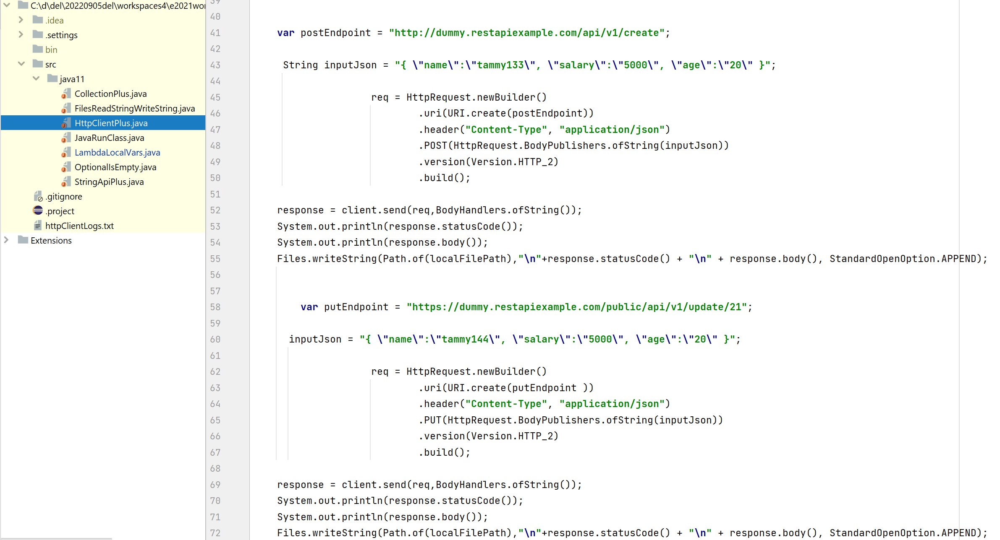
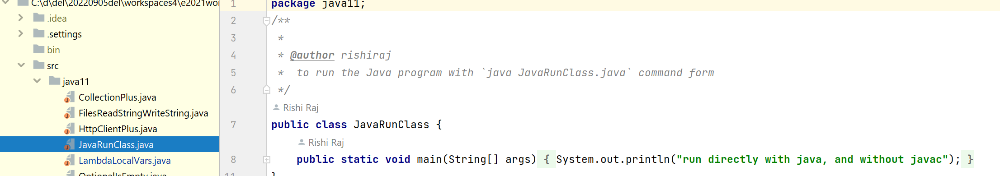
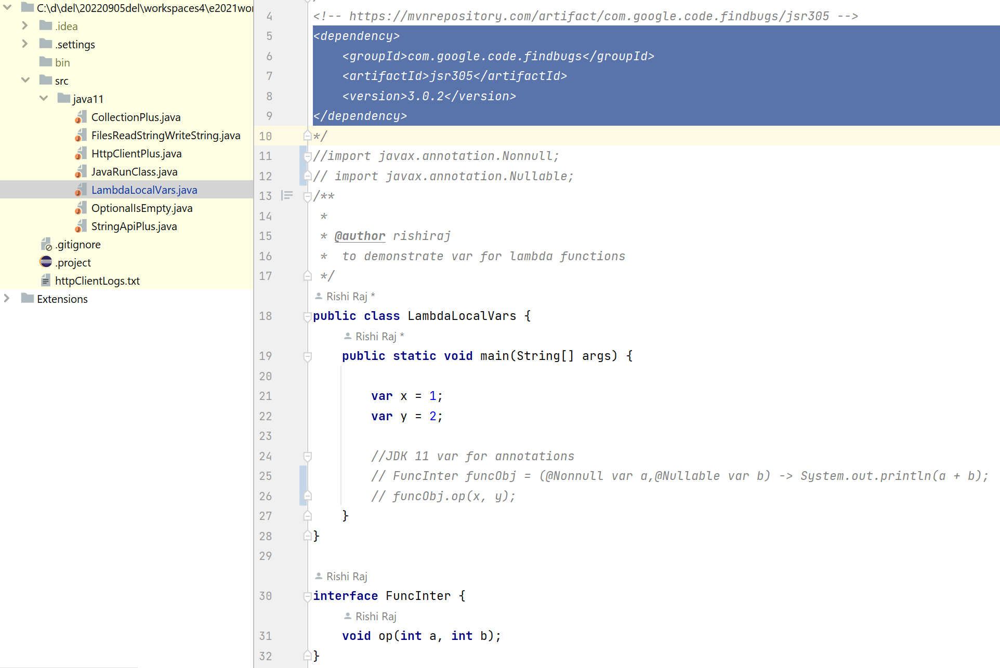
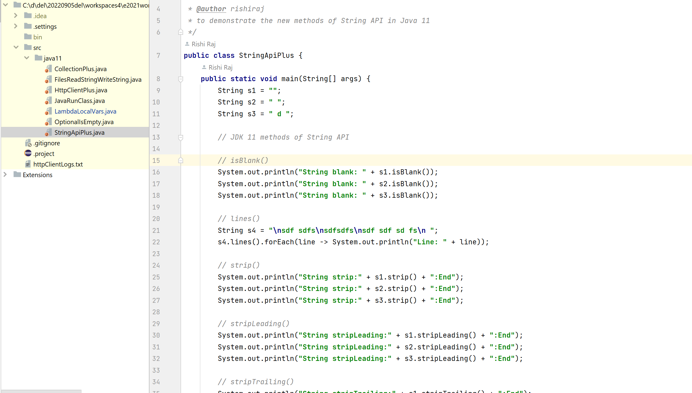
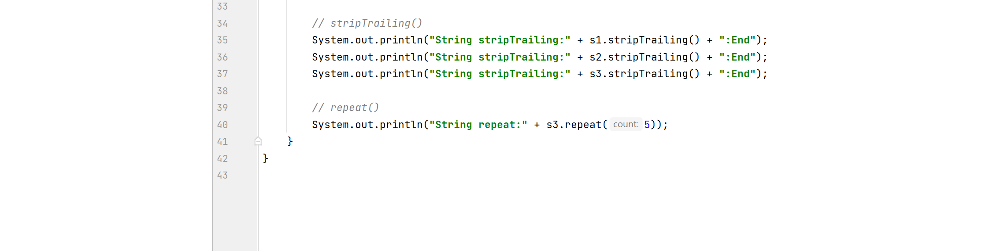

# Java 11 Features

## Collection Plus

## Files.readString() and Files.writeString()

## HttpClient Plus

## Java JavaClassName to Run Code

## Local Variables for Lambda

## Optional.isEmpty()

## String Plus

