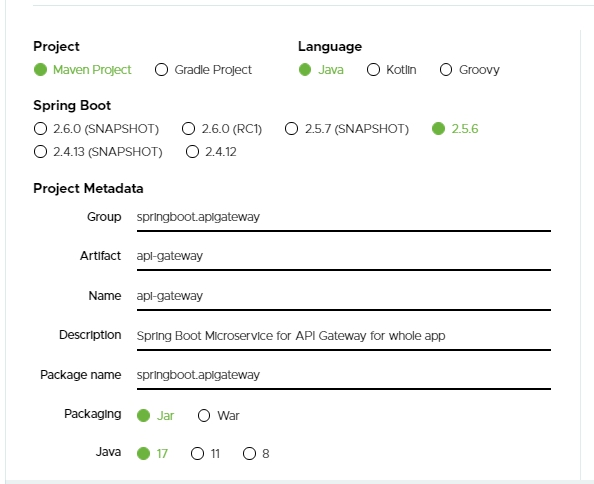
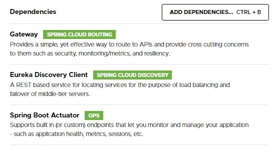

# CodeSamples
code samples and quick PoC's

## Main Repositories

### [CodeSamples](https://github.com/rishiraj88/CodeSamples)

### [LeetCode](https://github.com/rishiraj88/LeetCode)

### [CompilersInterpreters](https://github.com/rishiraj88/CompilersInterpreters)

### [HackerRank](https://github.com/rishiraj88/HackerRank)

### [GeeksForGeeks](https://github.com/rishiraj88/GeeksForGeeks)

### [Ember.js](https://github.com/rishiraj88/Ember)

### [RRShopware](https://github.com/rishiraj88/RRShopware)

### [RRShopware](https://github.com/rishiraj88/RRShopware)

### [RRShopware](https://github.com/rishiraj88/RRShopware)

# Sping Boot With Eureka
A project showcasing Eureka Service Discovery implemented for Microservices.
The following have been used here:

- Spring Boot v2.5.6
- Java 17
- Various dependencies for different Microservices/modules

### Spring Boot and Java Specifications:

### Some of the dependencies for Gateway, Service Discovery Client and Actuator functionalities:

## Short Documentation

The URL to access API Gateway is:
http://localhost
Port for this is 80.

Two business microservices user-service and contact-service can be accessed at the socket of API Gateway:

**user-service:**

> http://localhost/user/2024

**contact-service:**

> http://localhost/contact/user/2024

This is the ease provided by Eureka Service Discovery and the implementation of API Gateway pattern for microservices architecture.

# CodeSamples

To visit the cloud-hosted site, smile and step in to [RRShops](https://rrshops.netlify.app/)

## 1. Java 17 Features [Link](https://github.com/rishiraj88/CodeSamples/tree/main/Java17Features/src)
- restore always-Strict floating-point semantics
- enhanced pseudo-random number generators
- new macOS rendering pipeline
- macOS/AArch64 port
- deprecate the Applet API for removal
- strongly encapsulate JDK internals
- pattern matching for switch (preview)
- remove RMI activation
- sealed classes
- remove the experimental AOT and JIT compilers
- deprecate the Security Manager for removal
- Foreign Function and Memory API (incubator)
- Vector API (second incubator)
- context-specific deserialization filters
Source code will be available soon.

## 2. Java 14 Features [Link](https://github.com/rishiraj88/CodeSamples/tree/main/Java14FeaturesPoc/src)
JDK 14 features used in various implementations:
- **InstanceofPatternMatching.java :** to declare reference for matching object upon checking its type
- **NullPointerExceptionPlus.java :** to get a more descriptive NPE description
- **RecordVsClass.java :** to demonstrate and use Record type
- **SwitchExpressions.java :** to use switch expressions instead of switch statements
- **TextBlockVsString.java :** to demonstrate a text block literal 

## 3. Java 11 Features [Link](https://github.com/rishiraj88/CodeSamples/tree/main/Java11Features/src/java11)
JDK 11 features used in various implementations:
- **CollectionPlus.java :** to get arrays out of lists
- **FilesReadStringWriteString.java :** to read from and write to file
- **HttpClientPlus.java :** to demonstrate HttpClient for GET, POST and PUT request/response handling as in JDK 11
- **JavaRunClass.java :** to run the Java program with `java JavaRunClass.java` command form
- **LambdaLocalVars.java :** to demonstrate var for lambda functions
- **OptionalIsEmpty.java :** to demonstrate Optional.isEmpty() 
- **StringApiPlus.java :** to demonstrate the new methods of String API in Java 11

## 4. LeetCode Problems Solved [Link](https://github.com/rishiraj88/LeetCode)
- **LC01TwoSum.java :** Given an array of integers nums and an integer target, return indices of the two numbers such that they add up to target.
- **LC02AddTwoNumbers.java :** Given two non-empty linked lists representing twonon-negative integers. The digits are stored in reverse order, and each of their nodes contains a single digit. Add the two numbers and return the sum as a linked list.
- **LcMaxConsecutiveOnes.java :** to find the length of the longest subsequence having only 1's else to return 0
- **LcSeptemberLeetcodingChallenge2021Week4.java :** [WIP] to get the maximum length of possible words made with the segments provided in input arrays,  with the condition that no letters in the words must be repeated anyhow
And more on the way!

## 5. RRShopware [Link](https://github.com/rishiraj88/RRShopware)
- a shopping site implementation with vanilla JavaScript, CSS and HTML
- To visit the cloud-hosted site, smile and step in to [RRShops](https://rrshops.netlify.app/)

## 6. More Java Samples [Link](https://github.com/rishiraj88/CodeSamples/tree/main/JavaSamples/src)
- **DefaultEleValue.java :** to test default values of elements of array
- **MedianOfTwoArrays.java :** to find the median for the elements of two arrays taken together
- **SecondLargest.java :** to find second largest element in an array of integers
- **FindDuplicatesInArray.java :** to  find duplicate elements in an array
- **FindDuplicatesInArrayByStream.java :** to find duplicate elements in an array
And more to come up!

### Notes
These repositories feature in-development programs and projects, too.
By the way, continuous development and continuous integration is my personal favorite.

## More to come up soon!