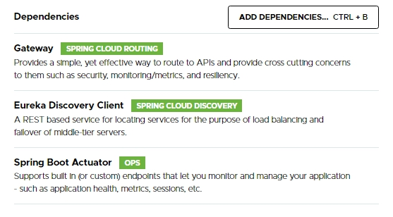

# Sping Boot With Eureka
A project showcasing Eureka Service Discovery implemented for Microservices.
The following have been used here:

- Spring Boot v2.5.6
- Java 17
- Various dependencies for different Microservices/modules

### Spring Boot and Java Specifications:

### Some of the dependencies for Gateway, Service Discovery Client and Actuator functionalities:

## Short Documentation

The URL to access API Gateway is:
http://localhost
Port for this is 80.

Two business microservices user-service and contact-service can be accessed at the socket of API Gateway:

**user-service:**

> http://localhost/user/2024

**contact-service:**

> http://localhost/contact/user/2024

This is the ease provided by Eureka Service Discovery and the implementation of API Gateway pattern for microservices architecture.